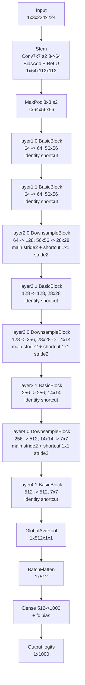
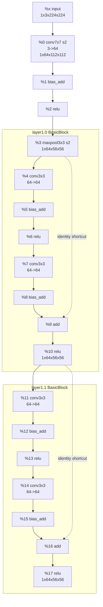
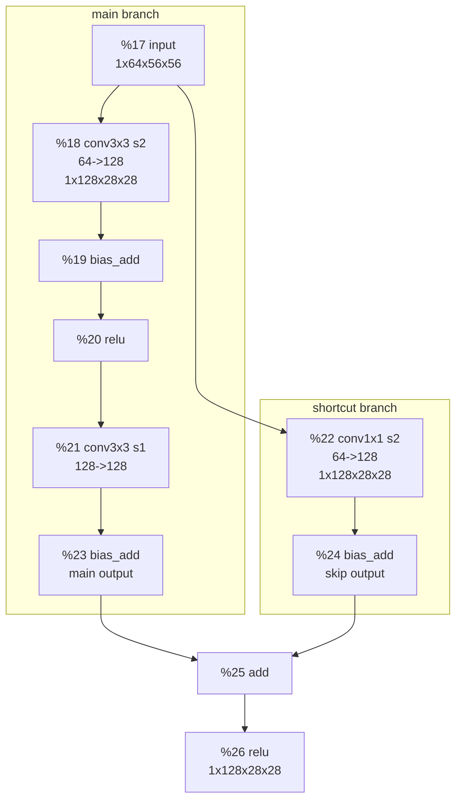
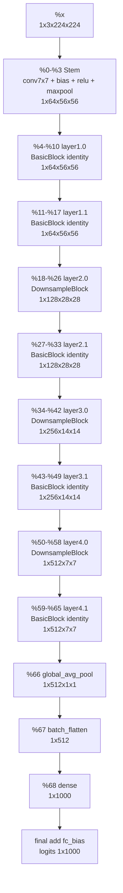
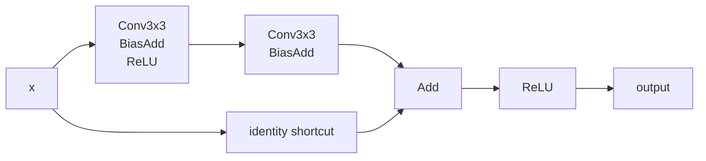
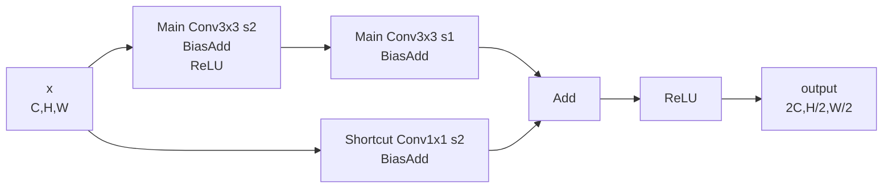

本文基于 TVM 0.19.0 示例日志 `toys/resnet18/resnet18_relay.log`，重点解析其中的 `=== IR BEFORE Optimization ===` 部分。优化后的 IR 会出现算子融合、layout 改写、primitive function 拆分等变化，不适合作为“原始网络结构”的阅读入口。

这篇文章的目标是把 ResNet18 和 Relay IR 对齐起来：既看懂模型结构，也知道面对一段 Relay IR 时应该先看什么、怎么找残差连接、怎么跟踪 shape 和变量编号。

## 1. 结论先看 {#overview}

这份优化前 Relay IR 对应一个 ResNet18 图像分类网络，输入是：

```text
%x: Tensor[(1, 3, 224, 224), float32]
```

也就是 NCHW 格式：

```text
N = 1       batch size
C = 3       RGB channel
H = 224     height
W = 224     width
```

输出是：

```text
Tensor[(1, 1000), float32]
```

表示 1000 类分类 logits。

从 IR 读到的主结构是：

```text
Input 1x3x224x224
  -> conv1 7x7 stride2, 64 channels
  -> bias_add
  -> relu
  -> maxpool 3x3 stride2
  -> layer1: 2 basic blocks, 64 channels, 56x56
  -> layer2: 2 basic blocks, 128 channels, 28x28
  -> layer3: 2 basic blocks, 256 channels, 14x14
  -> layer4: 2 basic blocks, 512 channels, 7x7
  -> global_avg_pool2d
  -> batch_flatten
  -> dense 512 -> 1000
  -> add fc bias
  -> logits 1x1000
```

这份 IR 中没有显式 `nn.batch_norm`。优化前 IR 里每个卷积后表现为 `nn.conv2d + nn.bias_add`，然后接 `nn.relu` 或残差 `add`。标准 ResNet18 通常含 BatchNorm；这里应以当前 Relay IR 为准：BN 没有作为独立 Relay op 出现，可能在导出/转换前后已经被折叠进卷积参数，或者模型来源本身已经是等价的 Conv+Bias 形式。

## 2. 如何阅读 Relay IR {#how-to-read-relay-ir}

先看优化前 IR 的第一行：

```text
def @main(%x: Tensor[(1, 3, 224, 224), float32]) -> Tensor[(1, 1000), float32] {
```

它表示：

- `@main`：Relay 模块里的主函数。
- `%x`：输入变量。
- `Tensor[(1, 3, 224, 224), float32]`：输入类型和 shape。
- `-> Tensor[(1, 1000), float32]`：函数输出类型和 shape。
- `{ ... }`：函数体，里面是一串数据流表达式。

Relay IR 可以先按“赋值链”来读：

```text
%0 = op(%x, weight)
%1 = op(%0, bias)
%2 = op(%1)
...
```

每个 `%编号` 都是一个中间张量。后面的算子会引用前面产生的张量。

### 2.1 一行 Relay IR 怎么拆 {#relay-ir-line}

以优化前 IR 的第一层卷积为例：

```text
%0 = nn.conv2d(
  %x,
  meta[relay.Constant][0],
  strides=[2, 2],
  padding=[3, 3, 3, 3],
  channels=64,
  kernel_size=[7, 7]
) /* ty=Tensor[(1, 64, 112, 112), float32] */;
```

可以拆成：

| 片段 | 含义 |
|---|---|
| `%0 =` | 这个算子的输出被命名为 `%0` |
| `nn.conv2d` | Relay 算子名，表示二维卷积 |
| `%x` | 第一个输入，是上一层张量；这里是模型输入图像 |
| `meta[relay.Constant][0]` | 常量参数，通常是权重或 bias |
| `strides=[2, 2]` | 卷积步长，高宽各跨 2 |
| `padding=[3, 3, 3, 3]` | 上、左、下、右 padding 都是 3 |
| `channels=64` | 输出通道数是 64 |
| `kernel_size=[7, 7]` | 卷积核大小是 7x7 |
| `ty=Tensor[(1, 64, 112, 112), float32]` | 类型推导结果：输出 shape 和 dtype |
| `span=/conv1/Conv` | 源模型中的节点名，能帮助对应回 ONNX/PyTorch 层名 |

读 Relay IR 时，最重要的是看三件事：

```text
1. 算子名：nn.conv2d / nn.relu / add / nn.dense ...
2. 输入是谁：这个算子消费哪些 %变量
3. 输出 shape：ty=Tensor[...] 告诉你数据形状如何变化
```

### 2.2 `meta[relay.Constant]` 是什么 {#relay-constant}

类似：

```text
meta[relay.Constant][0]
meta[relay.Constant][1]
```

它们是模型里的常量参数，比如：

- 卷积权重
- 卷积 bias
- 全连接层权重
- 全连接层 bias

例如：

```text
meta[relay.Constant][0] /* ty=Tensor[(64, 3, 7, 7), float32] */
```

这说明它是第一层卷积权重，shape 是：

```text
out_channels = 64
in_channels = 3
kernel_h = 7
kernel_w = 7
```

### 2.3 怎么识别残差连接 {#residual-connection}

残差连接在 Relay IR 里就是 `add`，例如：

```text
%9 = add(%8, %3)
%10 = nn.relu(%9)
```

含义是：

```text
主分支输出 %8
shortcut 分支输出 %3
两者相加得到 %9
再 ReLU 得到 block 输出 %10
```

如果 `add` 的两个输入 shape 一样，并且 shortcut 直接来自 block 输入，就是 identity shortcut。

如果 `add` 的 shortcut 输入来自一个 `1x1 conv stride2`，就是 downsample shortcut，例如：

```text
%22 = nn.conv2d(%17, ..., strides=[2, 2], kernel_size=[1, 1])
%24 = nn.bias_add(%22, ...)
%25 = add(%23, %24)
```

这里 `%24` 就是 shortcut 分支投影后的结果。

### 2.4 为什么优化后 IR 不适合看原始结构 {#before-vs-after-optimization}

优化后 IR 会把一些算子融合成 primitive function，例如把：

```text
conv2d -> bias/add -> relu
```

融合成一个函数调用。它更接近编译器准备生成代码的形态，不再是最直观的网络结构。因此本文主要看 `IR BEFORE Optimization`。

## 3. 总体结构图 {#overall-structure}



## 4. 更细的 Dataflow / CDFG-like 图 {#dataflow-cdfg}

严格说，这份 Relay IR 没有 `if`、`while` 这类显式控制流，所以它不是复杂控制流图；它主要是 data-flow graph。下面的图按 Relay 变量编号画数据依赖，比上一节的结构图更接近 CDFG/DFG。

### 4.1 Stem + layer1 的细粒度数据流 {#stem-layer1-dataflow}



### 4.2 layer2.0：带 downsample 的残差块 {#layer2-downsample}

`layer2.0` 是第一次通道翻倍和空间下采样。主分支和 shortcut 分支都从 `%17` 出发，最后在 `%25` 相加。



### 4.3 四个 stage 的 block-level DFG {#stage-dfg}

这张图把每个残差块抽象成一个节点，但保留了 stage 的 shape 演进和 downsample 位置。



### 4.4 残差 add 的数据依赖总表 {#residual-add-table}

每个 `add` 都是一个残差汇合点：

| Block | 主分支输出 | Shortcut 输出 | Add 节点 | Block 输出 |
|---|---|---|---|---|
| `layer1.0` | `%8` | `%3` | `%9 = add(%8, %3)` | `%10` |
| `layer1.1` | `%15` | `%10` | `%16 = add(%15, %10)` | `%17` |
| `layer2.0` | `%23` | `%24` | `%25 = add(%23, %24)` | `%26` |
| `layer2.1` | `%31` | `%26` | `%32 = add(%31, %26)` | `%33` |
| `layer3.0` | `%39` | `%40` | `%41 = add(%39, %40)` | `%42` |
| `layer3.1` | `%47` | `%42` | `%48 = add(%47, %42)` | `%49` |
| `layer4.0` | `%55` | `%56` | `%57 = add(%55, %56)` | `%58` |
| `layer4.1` | `%63` | `%58` | `%64 = add(%63, %58)` | `%65` |

## 5. ResNet18 的核心：残差块 {#residual-blocks}

ResNet 的关键不是卷积本身，而是残差连接：

```text
output = ReLU(F(x) + shortcut(x))
```

其中：

- `F(x)` 是主分支，通常是两个 3x3 卷积。
- `shortcut(x)` 是跳连分支。如果输入输出 shape 一样，就是原样传过去；如果通道数或空间尺寸变了，就用 1x1 卷积投影。
- `add` 是残差相加。
- `ReLU` 是相加后的非线性激活。

### 5.1 普通 BasicBlock {#basicblock}

普通 BasicBlock 用在 shape 不变的地方，例如 `layer1.0`、`layer1.1`、`layer2.1`、`layer3.1`、`layer4.1`。



对应 Relay 形态：

```text
%conv1 = nn.conv2d(input, weight1, padding=[1,1,1,1])
%bias1 = nn.bias_add(%conv1, bias1)
%relu1 = nn.relu(%bias1)
%conv2 = nn.conv2d(%relu1, weight2, padding=[1,1,1,1])
%bias2 = nn.bias_add(%conv2, bias2)
%add   = add(%bias2, input)
%out   = nn.relu(%add)
```

### 5.2 DownsampleBlock {#downsample-block}

DownsampleBlock 用在每个 stage 的第一个 block，但 `layer1` 例外。它负责同时完成：

- 空间尺寸减半：`56x56 -> 28x28`、`28x28 -> 14x14`、`14x14 -> 7x7`
- 通道数翻倍：`64 -> 128`、`128 -> 256`、`256 -> 512`

主分支的第一个 3x3 卷积使用 `strides=[2, 2]`；shortcut 分支使用 1x1 卷积，也使用 `strides=[2, 2]`，让两条分支的 shape 对齐后才能相加。



对应 Relay 形态：

```text
main1 = conv3x3(input, stride=2) -> bias_add -> relu
main2 = conv3x3(main1, stride=1) -> bias_add
skip  = conv1x1(input, stride=2) -> bias_add
out   = relu(add(main2, skip))
```

## 6. 按 IR 变量编号拆解 {#ir-variable-breakdown}

下面表格直接对应优化前 Relay IR 中的 `%0`、`%1` 这类变量。

### 6.1 Stem {#stem}

| IR 变量 | Relay op | 输出 shape | 含义 |
|---|---|---|---|
| `%x` | input | `(1, 3, 224, 224)` | 输入图像，NCHW |
| `%0` | `nn.conv2d` 7x7, stride2, pad3, 3->64 | `(1, 64, 112, 112)` | 第一层大卷积，快速降低空间尺寸 |
| `%1` | `nn.bias_add` | `(1, 64, 112, 112)` | 加 conv1 bias |
| `%2` | `nn.relu` | `(1, 64, 112, 112)` | 非线性激活 |
| `%3` | `nn.max_pool2d` 3x3, stride2, pad1 | `(1, 64, 56, 56)` | 下采样，进入残差 stage |

### 6.2 layer1：两个 64-channel BasicBlock {#layer1}

| Block | 主分支 | Shortcut | Add/ReLU | 输出 |
|---|---|---|---|---|
| `layer1.0` | `%4 -> %5 -> %6 -> %7 -> %8` | `%3` identity | `%9 = add(%8, %3)`, `%10 = relu(%9)` | `(1, 64, 56, 56)` |
| `layer1.1` | `%11 -> %12 -> %13 -> %14 -> %15` | `%10` identity | `%16 = add(%15, %10)`, `%17 = relu(%16)` | `(1, 64, 56, 56)` |

`layer1` 不改变空间尺寸和通道数：

```text
1x64x56x56 -> 1x64x56x56
```

### 6.3 layer2：64 -> 128，56x56 -> 28x28 {#layer2}

| Block | 主分支 | Shortcut | Add/ReLU | 输出 |
|---|---|---|---|---|
| `layer2.0` | `%18` conv3x3 stride2 -> `%19` bias -> `%20` relu -> `%21` conv3x3 -> `%23` bias | `%22` conv1x1 stride2 -> `%24` bias | `%25 = add(%23, %24)`, `%26 = relu(%25)` | `(1, 128, 28, 28)` |
| `layer2.1` | `%27 -> %28 -> %29 -> %30 -> %31` | `%26` identity | `%32 = add(%31, %26)`, `%33 = relu(%32)` | `(1, 128, 28, 28)` |

`layer2.0` 是 DownsampleBlock，因为主分支和 shortcut 都需要改变 shape。

### 6.4 layer3：128 -> 256，28x28 -> 14x14 {#layer3}

| Block | 主分支 | Shortcut | Add/ReLU | 输出 |
|---|---|---|---|---|
| `layer3.0` | `%34` conv3x3 stride2 -> `%35` bias -> `%36` relu -> `%37` conv3x3 -> `%39` bias | `%38` conv1x1 stride2 -> `%40` bias | `%41 = add(%39, %40)`, `%42 = relu(%41)` | `(1, 256, 14, 14)` |
| `layer3.1` | `%43 -> %44 -> %45 -> %46 -> %47` | `%42` identity | `%48 = add(%47, %42)`, `%49 = relu(%48)` | `(1, 256, 14, 14)` |

### 6.5 layer4：256 -> 512，14x14 -> 7x7 {#layer4}

| Block | 主分支 | Shortcut | Add/ReLU | 输出 |
|---|---|---|---|---|
| `layer4.0` | `%50` conv3x3 stride2 -> `%51` bias -> `%52` relu -> `%53` conv3x3 -> `%55` bias | `%54` conv1x1 stride2 -> `%56` bias | `%57 = add(%55, %56)`, `%58 = relu(%57)` | `(1, 512, 7, 7)` |
| `layer4.1` | `%59 -> %60 -> %61 -> %62 -> %63` | `%58` identity | `%64 = add(%63, %58)`, `%65 = relu(%64)` | `(1, 512, 7, 7)` |

### 6.6 分类头 {#classification-head}

| IR 变量 | Relay op | 输出 shape | 含义 |
|---|---|---|---|
| `%66` | `nn.global_avg_pool2d(%65)` | `(1, 512, 1, 1)` | 每个 channel 全局平均，把 7x7 压到 1x1 |
| `%67` | `nn.batch_flatten(%66)` | `(1, 512)` | 展平成分类向量 |
| `%68` | `nn.dense(%67, weight, units=1000)` | `(1, 1000)` | 全连接分类层 |
| final | `add(%68, fc_bias)` | `(1, 1000)` | 加分类 bias，得到 logits |

## 7. Shape 演进 {#shape-evolution}

| 阶段 | 输出 shape | 说明 |
|---|---|---|
| Input | `(1, 3, 224, 224)` | 输入图片 |
| Stem Conv7x7 s2 | `(1, 64, 112, 112)` | 空间尺寸减半，通道到 64 |
| MaxPool3x3 s2 | `(1, 64, 56, 56)` | 再次减半 |
| layer1 | `(1, 64, 56, 56)` | 2 个 BasicBlock，shape 不变 |
| layer2 | `(1, 128, 28, 28)` | stage 首 block 下采样，通道翻倍 |
| layer3 | `(1, 256, 14, 14)` | stage 首 block 下采样，通道翻倍 |
| layer4 | `(1, 512, 7, 7)` | stage 首 block 下采样，通道翻倍 |
| GlobalAvgPool | `(1, 512, 1, 1)` | 每个 channel 汇聚成一个值 |
| Flatten | `(1, 512)` | 转成向量 |
| Dense + Bias | `(1, 1000)` | 1000 类 logits |

## 8. 为什么叫 ResNet18 {#why-resnet18}

经典 ResNet18 的“18”通常按可学习的主干层数计：

```text
conv1: 1 层
4 个 stage，每个 stage 2 个 BasicBlock，每个 BasicBlock 2 个 3x3 conv:
  4 * 2 * 2 = 16 层
fc: 1 层

合计 1 + 16 + 1 = 18
```

在这份 Relay IR 中，还能看到 `layer2.0`、`layer3.0`、`layer4.0` 的 shortcut 分支各有一个 1x1 projection conv。这些 projection conv 用来对齐残差分支 shape，通常不计入 ResNet18 名字里的“18”。

## 9. 这份 IR 中需要重点关注的算子 {#key-operators}

| 算子 | 在 ResNet18 中的作用 |
|---|---|
| `nn.conv2d` | 特征提取，3x3 conv 是残差块主体，1x1 conv 用于 downsample shortcut |
| `nn.bias_add` | 给卷积或全连接输出加 bias |
| `nn.relu` | 非线性激活；每个残差块在第一个 conv 后和 residual add 后各有一次 |
| `add` | 残差连接的核心，主分支与 shortcut 分支相加 |
| `nn.max_pool2d` | stem 后的早期下采样 |
| `nn.global_avg_pool2d` | 分类头前的全局空间汇聚 |
| `nn.batch_flatten` | 从 `(1, 512, 1, 1)` 转成 `(1, 512)` |
| `nn.dense` | 最后的 1000 类分类层 |

## 10. 优化前 IR 的阅读要点 {#reading-tips}

1. 先找 shape 变化：`224 -> 112 -> 56 -> 28 -> 14 -> 7 -> 1`。
2. 再找 stage 边界：通道数 `64 -> 128 -> 256 -> 512`。
3. 再找 residual `add`：每个 BasicBlock 末尾都有一次 `add`。
4. 如果 `add` 两边 shape 一样，就是 identity shortcut。
5. 如果 `add` 的 shortcut 分支前有 `1x1 conv stride2`，就是 downsample shortcut。
6. 这份 IR 中没有显式 `batch_norm`，不要按教科书结构强行寻找 BN 节点。

## 11. 一句话总结 {#summary}

这份优化前 Relay IR 展现的是一个清晰的 ResNet18：输入图片先经过 stem 下采样，然后依次进入 4 个 residual stage；每个 stage 有 2 个 BasicBlock；stage 的第一个 block 在 layer2/3/4 中通过 stride2 和 1x1 shortcut 完成下采样与通道扩展；最后通过全局平均池化和全连接层输出 1000 类 logits。
